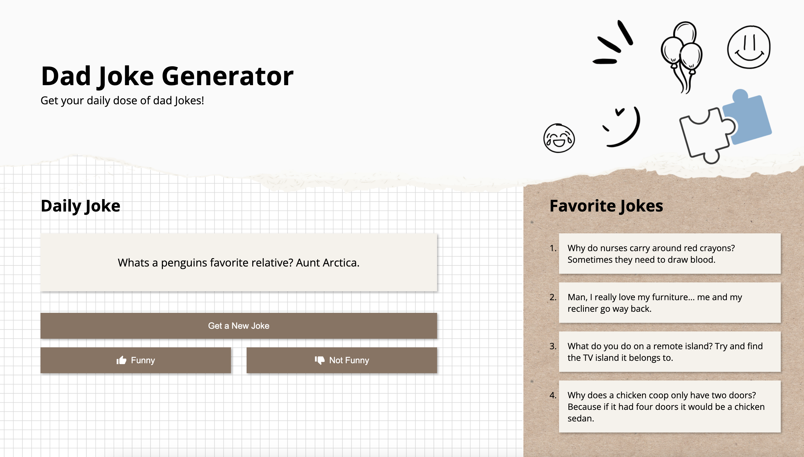

# Dad Joke Generator

A fun web application that generates random dad jokes using the [icanhazdadjoke API](https://icanhazdadjoke.com/api). Users can get new jokes, mark them as funny or not funny, and save their favorite jokes to a list.

## Features

- Generate random dad jokes
- Save favorite jokes to a list
- Rate jokes as funny or not funny
- Clean and responsive user interface
- No API key required

## Demo



## Technologies Used

- HTML5
- CSS3
- JavaScript (ES6+)
- Axios for API requests

## API Integration

This project uses the [icanhazdadjoke API](https://icanhazdadjoke.com/api) to fetch random dad jokes. The API is free to use and doesn't require authentication.

## Installation

1. Clone the repository:

```bash
git clone https://github.com/yourusername/dad-joke-generator.git
```

2. Navigate to the project directory:

```bash
cd dad-joke-generator
```

3. Open `index.html` in your preferred browser.

## Project Structure

```
dad-joke-generator/
│
├── assets/
│   ├── like.svg
│   └── dislike.svg
│
├── scripts/
│   ├── dad-joke-api.js
│   └── main.js
│
├── styles/
│   └── index.css
│
└── index.html
```

## Usage

1. Click the "Get a New Joke" button to generate a random dad joke
2. If you find the joke funny, click the "Funny" button to save it to your favorites
3. If you don't like the joke, click "Not Funny" to skip to the next one
4. View your saved favorite jokes in the "Favorite Jokes" section

## API Class Usage

```javascript
const dadJokeApi = new DadJokeApi();

// Get a random joke
const joke = await dadJokeApi.getJoke();
```

## Contact

Name of the contributor: Kalkidan, Michelle, Romina

Project Link: [https://github.com/hsiangyichen/dad-joke-generator](https://github.com/hsiangyichen/dad-joke-generator)
